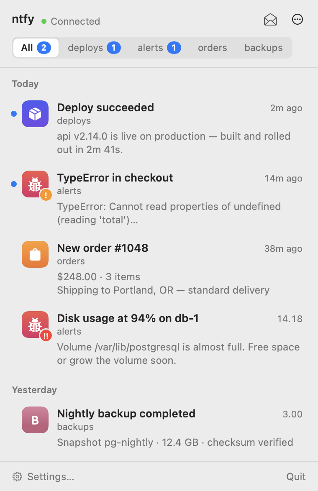
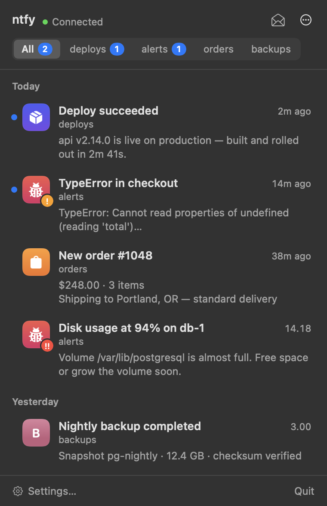

# ntfy-bar

A small, native macOS menu bar client for [ntfy](https://ntfy.sh), built for self-hosted servers.
It keeps one streaming connection open to your topics, shows recent messages in a popover, and
posts native macOS notifications.

<p align="center">
  
  
</p>

## Features

- **Menu bar only.** No Dock icon. The bell fills in and shows a count when there are unread messages.
- **Live stream.** One long-lived JSON stream for all topics, with Basic auth or an access token.
- **Nothing missed.** Reconnects resume from the last message you received. Backoff is exponential,
  capped at 60 s, and the app reconnects right away after wake or a network change.
- **Native notifications.** Each one has a title, the topic and a plain-text body, and is grouped
  by topic. Priority 4–5 messages play a sound. The message icon or image attachment appears as
  the thumbnail.
- **Popover.** Newest messages first, grouped by day. Topic filter with unread counts, markdown
  rendered as clean text, priority badges, and per-topic icons. Click a message to open its link.
- **Per-topic control.** Turn a topic off to stop subscribing without deleting it, or mute it to keep
  receiving messages silently.
- **Keychain.** The password and access token are stored in the Keychain, never in preferences.
- **Launch at login**, via `SMAppService`.
- **First-run import** from the ntfy CLI's `client.yml`.

## Requirements

- macOS 14 Sonoma or later
- Swift 6 toolchain: Xcode 16+ or the matching Command Line Tools
- An ntfy server (self-hosted or ntfy.sh)

## Install a release

Download `ntfy-bar-<version>.zip` from the
[latest release](https://github.com/KudcraftsHQ/ntfy-bar/releases/latest), unzip it and move
`ntfy-bar.app` to `~/Applications` (or `/Applications`).

The app is **ad-hoc signed, not notarized**, so the first launch is blocked by Gatekeeper
("Apple could not verify…"). Once per install:

1. Open the app, dismiss the warning.
2. **System Settings › Privacy & Security**, scroll down, click **Open Anyway** next to ntfy-bar,
   and confirm.

Or from Terminal: `xattr -dr com.apple.quarantine ~/Applications/ntfy-bar.app`.

### Updates

ntfy-bar updates itself with [Sparkle](https://sparkle-project.org). It checks once a day,
downloads new versions in the background and installs them when the app quits (or when you
choose **Check for Updates…** in the popover's ⋯ menu or in Settings). Updates are verified
with an EdDSA signature, and Sparkle clears the quarantine flag on them, so the Gatekeeper step
is only needed for the first install.

## Build from source

```sh
git clone https://github.com/KudcraftsHQ/ntfy-bar.git
cd ntfy-bar
./build.sh --run
```

`build.sh` runs a release `swift build`, assembles `ntfy-bar.app` (with `LSUIElement` set),
ad-hoc signs it and installs it to `~/Applications/ntfy-bar.app`. If an older copy is running,
it is restarted.

| Command | Does |
|---|---|
| `./build.sh` | Build and install |
| `./build.sh --run` | Build, install and launch |
| `./build.sh --no-install` | Only produce `build/ntfy-bar.app` |

### Signing and notifications

The app is **ad-hoc signed** (`codesign -s -`), so no Apple Developer account is needed. The first
time it launches, macOS asks whether ntfy-bar may send notifications. Click **Allow**. If you missed
the prompt, enable it in **System Settings › Notifications › ntfy-bar**. The popover footer warns
you when notifications are off.

## Configuration

Open **Settings…** from the popover (⌘,):

| Setting | Notes |
|---|---|
| Server URL | e.g. `https://ntfy.example.com` |
| Username / Password | Basic auth. The password goes to the Keychain |
| Access token | Optional. Sent as `Bearer` and takes precedence over the password |
| Topics | Add topics. Each one has an **on/off** switch (off = not subscribed) and a **mute** toggle (listed, but no notification). Remove a topic from its context menu; you'll be asked to confirm |
| Play sound for every message | By default only priority 4–5 messages play a sound |
| Launch at login | May require approval in System Settings › General › Login Items |

### First-run import

If there are no settings yet, ntfy-bar reads the ntfy CLI config at
`~/Library/Application Support/ntfy/client.yml` and imports `default-host`, `default-user`,
`default-password` (or `default-token`) and every `- topic:` entry under `subscribe:`. The
password is moved straight into the Keychain. If the file doesn't exist, the Settings window opens.

## How it works

- **Streaming.** `GET {server}/{topic1,topic2,…}/json`, read line by line with
  `URLSession.bytes(for:)`. `open`, `keepalive` and `message` events are handled; others are ignored.
- **Resuming.** Reconnects pass `?since=<last message id>`. If the last message is older than
  6 hours, they pass its timestamp instead, because servers only cache message ids for about 12 hours.
  The very first connection loads the last hour into the list without notifying. Messages are
  de-duplicated by id.
- **Notifications.** Only messages that arrive while the app is running (with a 60 s grace period)
  and haven't been seen before trigger a notification, so backlog never floods you. Markdown is
  stripped from the body. Muted topics don't notify and don't count towards the badge.
- **Icons.** If a message has an image attachment, it is used as the notification thumbnail;
  otherwise its `icon` URL is. The image is downloaded with a 5 s limit and cached under
  `~/Library/Caches/ntfy-bar/`. Credentials are only sent when the image is hosted on your ntfy
  server. macOS doesn't allow a different app icon per notification, so the image appears as the
  thumbnail. In the popover, messages without an icon borrow the latest icon from their topic,
  or fall back to a coloured initial.
- **Click to open.** Clicking a notification opens the message's `click` URL. Clicking a row in the
  popover opens the `click` URL, or the first link in the body if there is none.
- **Read state.** Opening the popover marks the visible messages as read. They keep their blue dot
  until you close it.

Runtime data lives in `~/Library/Application Support/ntfy-bar/`:
`state.json` holds the last 500 messages, read state and the resume position.

## Security notes

- Keychain items are created with an **"allow all applications"** access list. Ad-hoc signed
  builds get a new code identity every time you rebuild, and a per-app access list would make
  each new build ask for Keychain access. In practice this matches the ntfy CLI, which keeps the
  same password in plain text in `client.yml`. If that trade-off doesn't suit you, use a
  limited-scope access token.
- Credentials are only sent to your ntfy server, never to third-party icon hosts.
- The debug log never contains credentials or message bodies.

## Troubleshooting

- **Connection problems.** Check `~/Library/Application Support/ntfy-bar/debug.log`, which records
  connects, disconnects, HTTP errors and message ids. "Authentication failed" in the popover means
  the server returned 401 or 403.
- **No notifications.** Make sure they're allowed in System Settings › Notifications › ntfy-bar,
  and that the topic isn't muted.
- **Start over.** Run `defaults delete com.kudcrafts.ntfy-bar`, then relaunch to redo the
  first-run import.

## Development

```
Sources/NtfyBar/
  AppModel.swift      state, streaming, reconnect, ingest and persistence
  MenuView.swift      popover UI
  SettingsView.swift  settings window
  Notifier.swift      UNUserNotificationCenter posting and click handling
  IconCache.swift     icon and attachment cache
  Storage.swift       state file, settings, ntfy CLI config importer
  Snapshot.swift      renders the popover to PNG (screenshots)
  Updater.swift       Sparkle updater (feed and public key in Resources/Info.plist)
Sources/KeychainShim/ C shim for the Keychain access list
scripts/make-icon.swift  regenerates Resources/AppIcon.icns
```

Regenerate the README screenshots from built-in sample data:

```sh
./build.sh --no-install
build/ntfy-bar.app/Contents/MacOS/ntfy-bar --snapshot docs/popover-light.png --sample
build/ntfy-bar.app/Contents/MacOS/ntfy-bar --snapshot docs/popover-dark.png --sample --dark
```

## Releasing

Push a tag: `git tag v1.2.0 && git push origin v1.2.0`. The `Release` workflow builds the app with
that version, zips it, signs the zip with the EdDSA key in the `SPARKLE_ED_PRIVATE_KEY` secret,
writes `appcast.xml`, checks the signature against `SUPublicEDKey` in the built app, and publishes
both files as a GitHub Release. The feed URL is
`https://github.com/KudcraftsHQ/ntfy-bar/releases/latest/download/appcast.xml`, so the newest
non-prerelease is always what Macs update to. Tags with a `-` (e.g. `v1.2.0-rc1`) are published
as prereleases and never offered as updates. Pull requests that touch the release path run the
same steps as a dry run.

## License

MIT © Kudcrafts. See [LICENSE](LICENSE).
